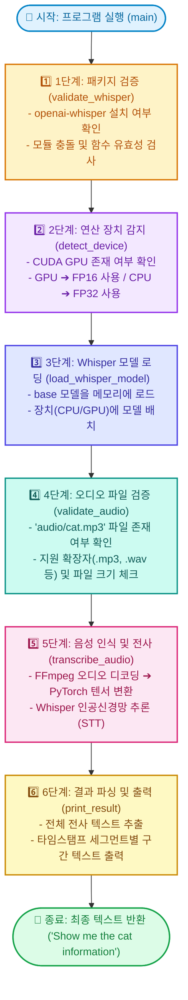
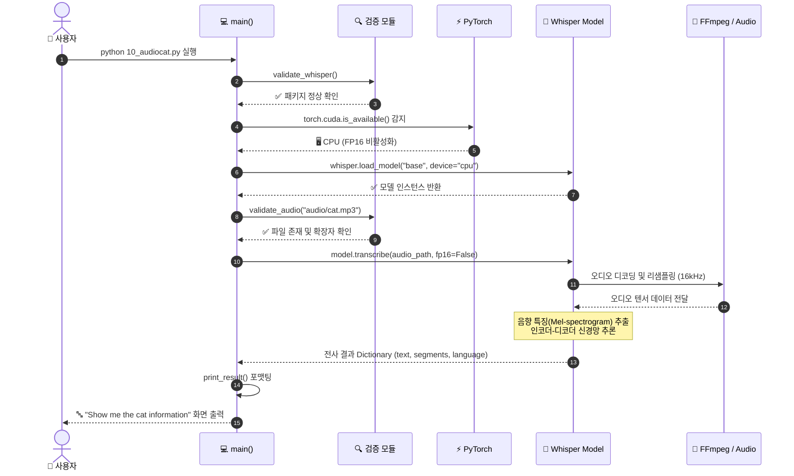
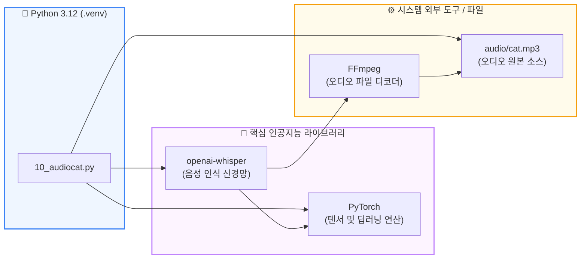

# 🎙️ OpenAI Whisper 음성 인식 완벽 가이드 (`10_audiocat.py`)

이 문서는 <code>10_audiocat.py</code>에서 사용된 <strong>OpenAI Whisper 기반 음성-텍스트 변환(STT, Speech-to-Text) 파이프라인</strong>의 6단계 흐름과 구조를 시각화한 가이드입니다.

---

## 🧭 1. 전체 6단계 파이프라인 흐름도 (Pipeline Flowchart)

음성 파일(`cat.mp3`)이 텍스트로 변환되어 출력되기까지의 6단계 전체 처리 흐름입니다.

---

## 🔄 2. 상세 시퀀스 다이어그램 (Sequence Diagram)

파이썬 코드와 외부 라이브러리(PyTorch, Whisper, FFmpeg, 오디오 파일) 간의 상호작용 흐름입니다.

---

## 🧩 3. 시스템 아키텍처 및 의존성 관계도

---

## 📖 4. 6단계 함수별 상세 설명

### ① `validate_whisper()` — 패키지 유효성 검사
- **역할:** 잘못된 서드파티 `whisper` 패키지가 아닌 OpenAI 공식 `openai-whisper`가 설치되어 있는지 확인하고, 프로젝트 내에 동일한 이름의 `whisper.py` 파일이 있어 발생하는 모듈 충돌(Shadowing)을 방지합니다.

---

### ② `detect_device()` — 연산 장치(GPU/CPU) 자동 감지
- **역할:** NVIDIA CUDA 그래픽카드가 있으면 GPU를 사용하고, 없으면 CPU를 선택합니다. CPU에서는 `FP16` 연산 시 발생하는 불필요한 경고를 방지하기 위해 `FP32` 모드로 자동 전환합니다.

---

### ③ `load_whisper_model()` — Whisper 모델 가중치 로드
- **역할:** Whisper 모델(`base`, `small`, `medium`, `large` 등) 중 `base` 모델 가중치(약 140MB)를 다운로드/로드하여 메모리에 올립니다.

---

### ④ `validate_audio()` — 오디오 파일 유효성 검증
- **역할:** 지정된 파일 경로(`audio/cat.mp3`)가 실제 존재하는지 확인하고, 지원 가능한 오디오 형식(`.mp3`, `.wav`, `.m4a`, `.flac` 등)인지 검사합니다.

---

### ⑤ `transcribe_audio()` — 음성 인식(STT) 추론
- **역할:** 내부적으로 `FFmpeg`를 사용하여 오디오를 16,000Hz 모노 신호로 변환한 뒤, Whisper 신경망을 거쳐 음성을 텍스트로 변환합니다.

---

### ⑥ `print_result()` — 결과 출력 및 세그먼트 파싱
- **역할:** 최종 추출된 전체 텍스트와 함께 각 발화 구간(예: `[0.00s → 3.00s]`)의 타임스탬프 정보를 깔끔한 표 형태로 화면에 출력합니다.
