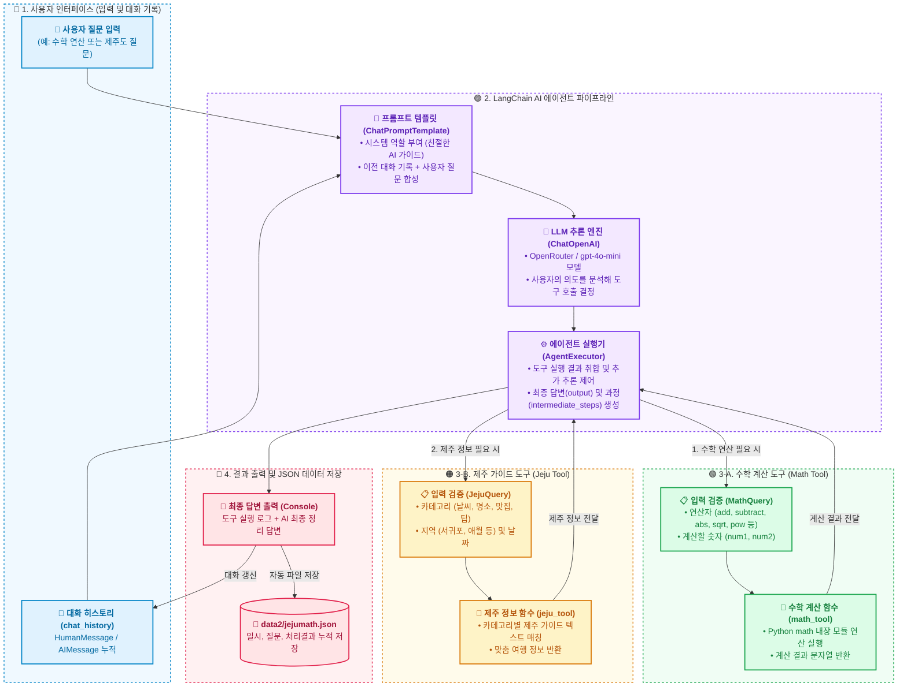
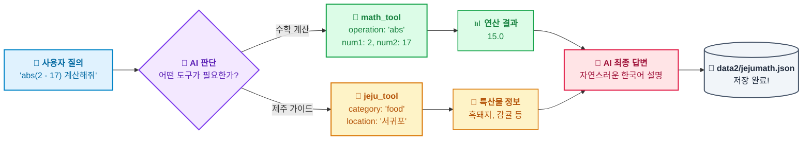
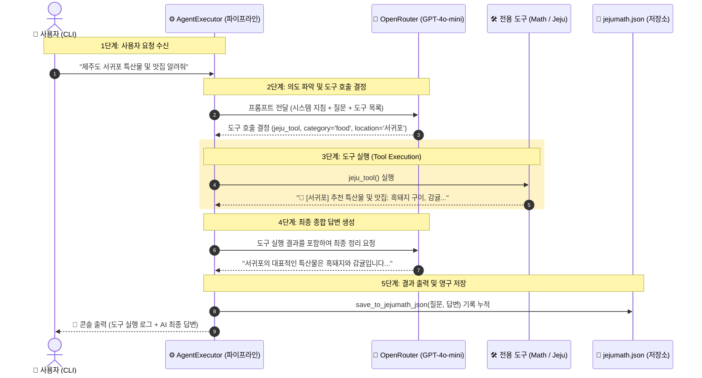

# 🗺️ mymathjeju.py 구조 및 실행 흐름 가이드

이 문서는 [mymathjeju.py](file:///c:/workAi/work9langchain/mymathjeju.py) 파일의 내부 구성 요소와 LangChain 도구 호출(Tool Calling) 동작 과정을 직관적으로 파악할 수 있도록 **색상별 영역 구분과 친절한 한글 설명**으로 구성된 다이어그램 문서입니다.

---

## 🎨 1. 전체 아키텍처 및 모듈 구성도

각 영역별로 기능에 맞는 **고유 색상**이 적용되어 있어 한눈에 구조를 파악할 수 있습니다:
- 🔵 **파란색 (Client)**: 사용자 질문 입력 및 히스토리 관리
- 🟣 **보라색 (LangChain Agent)**: LLM 판단 및 파이프라인 제어
- 🟢 **초록색 (수학 도구)**: 파이썬 math 연산 도구
- 🟠 **주황색 (제주도 도구)**: 제주 여행/날씨/맛집 안내 도구
- 🔴 **분홍색 (저장소 & 출력)**: 최종 답변 출력 및 JSON 파일 영구 저장

---

## ⚡ 2. 한눈에 보는 데이터 처리 흐름 (좌 ➔ 우 흐름도)

---

## ⏱️ 3. 상세 실행 시퀀스 다이어그램 (순서도)

---

## 📌 4. 모듈별 기능 및 데이터 매핑표

| 모듈 구분 | 파일 내 이름 | 색상 | 핵심 역할 및 설명 |
| :--- | :--- | :---: | :--- |
| **Pydantic 스키마** | `MathQuery` | 🟢 | 수학 연산 타입(`operation`) 및 숫자(`num1`, `num2`) 유효성 검사 및 `calculate()` 실행 |
| **Pydantic 스키마** | `JejuQuery` | 🟠 | 제주 정보 카테고리(`weather`, `food` 등) 유효성 검사 및 `get_jeju_info()` 실행 |
| **LangChain 도구** | `math_tool` | 🟢 | `@tool` 데코레이터를 적용한 수학 연산기 (사칙연산, `abs`, `round`, `sqrt`, `pow`) |
| **LangChain 도구** | `jeju_tool` | 🟠 | `@tool` 데코레이터를 적용한 제주도 맞춤 여행 가이드 |
| **AI 파이프라인** | `create_agent_pipeline` | 🟣 | OpenRouter 기반 `gpt-4o-mini` 모델과 도구들을 바인딩하여 `AgentExecutor` 생성 |
| **실행 및 기록** | `process_query` | 🔵 | 사용자 질문 처리, 대화 히스토리 갱신, 콘솔 로그 출력 |
| **JSON 저장소** | `save_to_jejumath_json` | 🔴 | 질의응답 결과를 `data2/jejumath.json` 파일에 시간순 누적 기록 |
