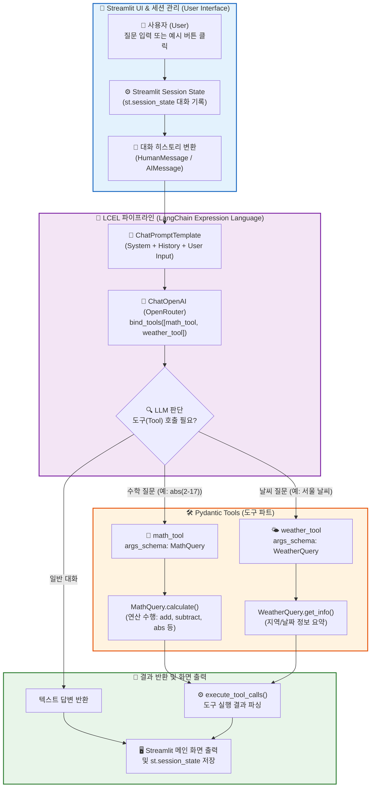
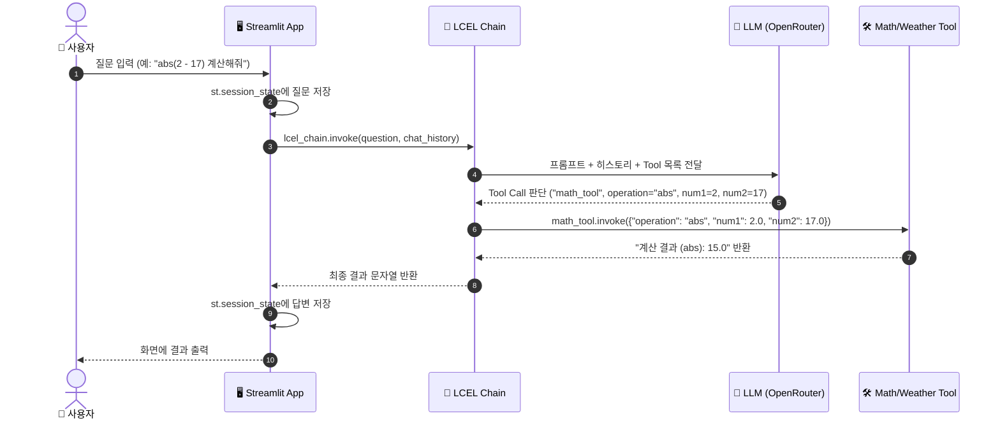

# 📘 test.py 파이프라인 구조도 및 코드 설명서 (Beginner's Guide)

이 문서에서는 `test.py` 코드의 전체적인 작동 원리와 구조를 초보자도 쉽게 이해할 수 있도록 **Mermaid 다이어그램**과 주요 구성요소별 설명으로 정리하였습니다.

---

## 💡 1. 한눈에 보는 전체 시스템 구조도 (System Architecture)

`test.py`는 **Streamlit UI**, **LangChain LCEL 파이프라인**, **Pydantic 스키마 기반 Tool**, **OpenRouter API**가 상호작용하며 작동합니다.

---

## 🧩 2. 핵심 구성 요소별 역할 설명 (Core Components)

### 1️⃣ Pydantic 입력 스키마 (`MathQuery`, `WeatherQuery`)
* **역할**: 도구(Tool)에 들어갈 데이터의 입력 형태(타입, 설명)를 정의하는 표준 규격입니다.
* **주요 클래스**:
  * `MathQuery`: `operation`(연산 종류: add, subtract, multiply, divide, abs), `num1`, `num2` 데이터를 검증하고 연산을 수행하는 `calculate()` 메서드를 포함합니다.
  * `WeatherQuery`: `location`(도시 이름), `date`(날짜), `unit`(온도 단위) 데이터를 검증하고 요약을 반환하는 `get_info()` 메서드를 포함합니다.

### 2️⃣ LangChain Tool 데코레이터 (`@tool(args_schema=...)`)
* **역할**: 일반 파이썬 함수를 AI 모델(LLM)이 이해하고 자동으로 호출할 수 있는 도구(Tool)로 등록합니다.
* **특징**: `args_schema` 인자에 Pydantic 클래스를 전달하여 AI가 정확한 데이터 형식에 맞춰 파라미터를 넘겨주도록 안내합니다.

### 3️⃣ OpenRouter API & LLM Tool Binding (`bind_tools`)
* **역할**: OpenRouter API를 통해 `openai/gpt-4o-mini` 모델을 불러오고, 앞서 정의한 도구 목록(`tools = [math_tool, weather_tool]`)을 모델에 바인딩합니다.
* **작동**: 사용자의 질문에 도구가 필요하다고 판단되면, 모델은 직접 답하는 대신 어떤 도구를 어떤 인자로 실행할지에 대한 **Tool Call 요청**을 반환합니다.

### 4️⃣ LCEL 파이프라인 (`lcel_chain`)
* **구조**: `prompt | model_with_tools | execute_tool_calls`
* **의미**: 
  1. `prompt`: 이전 대화 기록과 사용자 질문을 프롬프트로 생성합니다.
  2. `model_with_tools`: AI 모델이 프롬프트를 분석하여 답변이나 도구 호출을 판단합니다.
  3. `execute_tool_calls`: AI 모델이 판단한 도구를 실행하고 결과를 가공하여 최종 출력 문자열로 만들어 줍니다.

### 5️⃣ Streamlit UI & 세션 관리 (`st.session_state`)
* **사이드바 (Sidebar)**:
  * OpenRouter API 연결 상태 확인
  * 대화 세션 초기화 버튼 (`Clear Session`)
  * Temperature (창의성) 조절 슬라이더
  * 빠른 질문 예시 버튼 클릭 처리
* **메인 화면**:
  * `st.session_state["messages"]`를 이용해 새로고침 후에도 이전 대화 기록(Context)이 유지됩니다.

---

## 🔄 3. 데이터 흐름 순서도 (Data Execution Sequence)

---

## 📝 4. 요약 (Summary)

* `test.py`는 초보자도 쉽게 따라 할 수 있도록 **Pydantic(데이터 검증)** + **LangChain LCEL(Tool 연동 파이프라인)** + **Streamlit(세션 대화 UI)**을 결합한 대화형 어시스턴트 애플리케이션입니다.
* 질문이 들어오면 AI가 수학 연산이나 날씨 조회가 필요한지 자동으로 판별하고, 해당 도구를 호출한 결과를 대화창에 보여줍니다.
